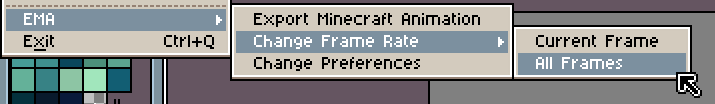

# EMA (Easy Minecraft Animation) Extension

The EMA extension for Aseprite simplifies the creation of animated textures for Minecraft, making it easier for you to bring your pixel art animations to life in the game.

## Installation

Getting started with EMA is straightforward. Just follow these simple steps:

1. [Download the Latest version of EMA](https://github.com/KuryKat/Export-Minecraft-Animation/releases/latest)

2. Open Aseprite and navigate to `Edit -> Preferences -> Extensions -> Add Extension`

3. Choose the file that you downloaded in the first step

4. The extension will be initialized, and you should see this output in the console:

   

5. You should now see a new Menu Group called "EMA" in the File Menu (`File -> EMA`).

### How it Works

EMA automates the process of exporting your Aseprite animation in a format that Minecraft can understand. It also generates the essential `.mcmeta` metadata file, ensuring that Minecraft plays each frame for the same duration specified in your Aseprite animation. You can even align the Aseprite Frame Rate with the Minecraft Frametime (Ticks Per Frame) effortlessly.

## Features

### Exporting Minecraft Animations

With EMA, exporting Aseprite animations as valid Minecraft animations is straightforward:

1. Create your animation in Aseprite.

2. Navigate to the EMA menu in Aseprite and execute the "Export Minecraft Animation" command (`File -> EMA -> Export Minecraft Animation`)

   

3. EMA will prompt you to enter the texture's name you are working on, such as "iron_ingot", with the default value being the sprite name.

4. It will also request the absolute path to the texture, with the default value being the location of the sprite.

5. Additionally, you can choose if you want to interpolate the frames and if you want to use each individual frametime or not

   (Note: By default, the extension will use the frame rate of the FIRST frame and convert it to Minecraft frametime)

6. Once you've filled in all the required fields, simply click the "Export Animation" button.

   

Two files will be created at the specified path: `<name>.png` and `<name>.png.mcmeta`.

### Change Frame Rate

To ensure your animation behaves in Aseprite the same way it does in Minecraft, you can adjust the frame rate with ease:

Follow these steps:

1. Navigate to the EMA menu in Aseprite and execute the "Change Frame Rate" command (`File -> EMA -> Change Frame Rate`)

2. Choose whether you want to change the frame rate for just the current frame or all frames (`Change Frame Rate -> Current Frame` or `Change Frame Rate -> All Frames`)

   

3. Specify how many ticks each frame should last and press "Confirm"

   

4. Your animation in Aseprite will now match its behavior in Minecraft, and the extension will export the frametime correctly when you [export animations](#exporting-minecraft-animations).

### Customizing Preferences

EMA offers various customizable options to enhance your experience. Here's a comprehensive overview of each setting:

To modify your preferences, navigate to the EMA menu and select "Change Preferences" (`File -> EMA -> Change Preferences`).

#### Default Folder Path

This is the folder where all animations are automatically exported to when the "Automatically Export Animation" feature is enabled.

#### Automatically Export Animation

Enabling this option streamlines the animation export process, skipping steps 3-6 outlined in [the process of exporting animations](#exporting-minecraft-animations). The sprite name is used as the file name, and the "Default Folder Path" is the destination.

#### Interpolate Frames

Toggle this setting to change the default interpolation behavior, allowing animations to have interpolation enabled by default.

#### Use Individual Frametime

Toggle this setting to change the default frametime behavior, allowing animations to use individual frametime by default.

## Contributing 💪

If you discover a bug or have suggestions for improving the extension, we welcome your contributions. Visit our [GitHub repository](https://github.com/KuryKat/Export-Minecraft-Animation/) to get involved and make EMA even better!

## Found a Bug? 🐛

Please report it on our [Issue Tracker](https://github.com/KuryKat/Export-Minecraft-Animation/issues) so that we can address and resolve it. Your feedback is invaluable in making EMA even better!
