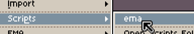
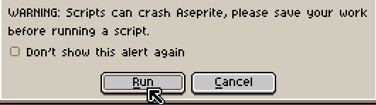

# EMA (Easy Minecraft Animation) Script

The EMA script for Aseprite simplifies the creation of animated textures for Minecraft, making it easier for you to bring your pixel art animations to life in the game.

## Installation

To begin using this script, follow these simple steps:

1. Open Aseprite and navigate to `File -> Scripts -> Open Scripts Folder`

2. Clone this repository with `git clone https://github.com/KuryKat/Export-Minecraft-Animation/`

3. Navigate to the `script` folder

4. Copy the [`ema.lua`](./ema.lua) file and Paste it into the scripts folder

5. Click the `Rescan Scripts Folder` button in Aseprite (`File -> Scripts -> Rescan Scripts Folder`)

6. You should now see a new script called "ema" in the scripts menu

## Usage

### How it Works

EMA (Easy Minecraft Animation) automates the process of exporting your Aseprite animation in a format that Minecraft can understand. It also creates the necessary metadata file, the `.mcmeta` file, which ensures that Minecraft plays each frame for the same duration as specified in your Aseprite animation.

### Step-by-Step Usage

1. Create your animation in Aseprite.

2. Navigate to the scripts menu in Aseprite and execute ema (`File -> Scripts -> ema`).

   

3. Aseprite will ask you if you want to run the script. Press "Run". Optionally, you can skip this step by clicking the "Don't show this alert again"

   

4. The script will prompt you to enter the name of the texture you are working on. For example, if you are creating an animation for an iron ingot, you would enter "iron_ingot".

5. It will also ask for the absolute path to the texture. The default value is where the sprite is located at.

6. Additionally, you can choose if you want to interpolate the frames and if you want to use each individual frametime or not

   (Note: By default the script will get the frame rate of the FIRST frame and convert it to Minecraft frametime)

7. Once you've filled in all fields, simply click the "Export Animation" button.

   

Two files will be created at the specified path: `<name>.png` and `<name>.png.mcmeta`.

## Extension

For a more complete version of the project, check the [Extension](../extension/README.md)! It does the same as the script, but a little more as well! With the extension you can easily set your Aseprite frame rate to match the minecraft frametime!

## Contributing 💪

If you discover a bug or have suggestions for improving the extension, we welcome your contributions. Visit our [GitHub repository](https://github.com/KuryKat/Export-Minecraft-Animation/) to get involved and make EMA even better!

## Found a Bug? 🐛

Please report it on our [Issue Tracker](https://github.com/KuryKat/Export-Minecraft-Animation/issues) so that we can address and resolve it. Your feedback is invaluable in making EMA even better!
